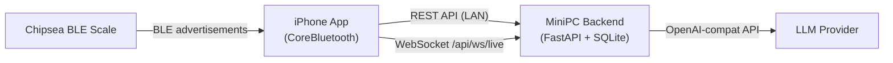
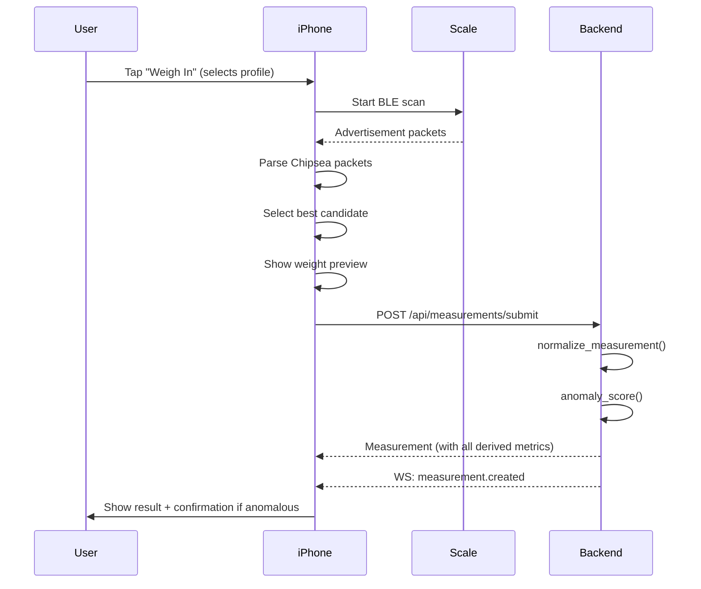

# Local Scale — iOS App Handoff Specification

## 1. Target Architecture



**Key decision**: iPhone is the **primary BLE capture device**. The MiniPC stays as a shared data backend (no Bleak needed on server). Family members share data via the same backend.

### Network Discovery

Use **Bonjour/mDNS** (`NWBrowser` on iOS, advertise `_localscale._tcp` on the MiniPC) so the iPhone auto-discovers the backend without hardcoding an IP.

---

## 2. Scale Hardware & BLE Protocol

### 2.1 Scale Identity

| Field | Value |
|-------|-------|
| Brand | Soundlogic (item `19181`, batch `2140082`) |
| App ecosystem | OKOK International |
| Protocol family | Chipsea-BLE / OKOK-compatible |
| Known BLE names | `Soundlogic`, `OKOK`, `Chipsea`, `BodyFatScale` |
| Known MAC | `41:06:4A:9D:15:1E` |

### 2.2 CoreBluetooth Scanning

**Advertisement-only** — you never call `connect(_:)`. The entire flow is:

```swift
// 1. Start scanning (no specific service UUID filter)
centralManager.scanForPeripherals(withServices: nil, options: [
    CBCentralManagerScanOptionAllowDuplicatesKey: true
])

// 2. Receive advertisements
func centralManager(_ central: CBCentralManager,
                    didDiscover peripheral: CBPeripheral,
                    advertisementData: [String: Any],
                    rssi RSSI: NSNumber) {
    // Extract manufacturer data
    guard let mfgData = advertisementData[CBAdvertisementDataManufacturerDataKey] as? Data else { return }
    // Parse with Chipsea parsers below
}
```

### 2.3 Device Matching Logic

Match a discovered peripheral if **any** of these are true:
1. **Target address match** — normalized MAC matches configured addresses
2. **Manufacturer MAC match** — trailing 6 bytes of manufacturer data match target MAC (or reversed)
3. **Target name match** — device name or local name contains a target token (case-insensitive)

**MAC normalization**: strip non-alphanumeric, lowercase, insert colons every 2 chars → `"41:06:4a:9d:15:1e"`

### 2.4 Chipsea Packet Parsers

#### Parser A: Broadcast (18+ byte manufacturer data)

Company IDs: `0xFFF0` or `0xF0FF`. Payload must be ≥ 18 bytes.

```
Byte layout:
[0]      = unknown
[1]      = properties byte
[2..3]   = raw weight (little-endian uint16)
[4..11]  = other fields (impedance wired but not yet populated)
[12..17] = MAC address (6 bytes)
```

**Properties byte decoding:**

```swift
let properties = payload[1]
let precisionMode = (properties >> 1) & 0b11
let unitMode = (properties >> 3) & 0b11

// Precision → divisor
// 0 → 100.0, 1 → 1.0, 2 → 10.0, else → nil (skip)

// Unit mode
// 0,1 → kg (weight = rawWeight / divisor)
// 2   → lbs (weight = (rawWeight / divisor) * 0.45359237)
```

**MAC validation**: Compare `payload[12..<18]` against expected MAC (also try reversed).

#### Parser B: Compact Advertisement (exactly 13 bytes)

```
Byte layout:
[0..1]  = weight (big-endian uint16, divide by 100.0 for kg)
[2..3]  = compact_field_2_4 (big-endian uint16, BIA-related)
[4..6]  = status bytes
[7..12] = MAC address (6 bytes)
```

**Validation rules:**
- Payload length must be exactly 13
- `payload[7..<13]` must match expected MAC exactly
- Weight must be in range `20.0...250.0 kg`
- `is_final_bia = compact_field_2_4 > 0 && payload[6] >= 0x25`

#### Swift Port (both parsers combined ~100 lines)

```swift
// Broadcast parser - core extraction
let rawWeight = UInt16(payload[2]) | (UInt16(payload[3]) << 8)  // little-endian
let weightKg = Double(rawWeight) / divisor

// Compact parser - core extraction
let rawWeight = UInt16(payload[0]) << 8 | UInt16(payload[1])    // big-endian
let weightKg = Double(rawWeight) / 100.0
```

### 2.5 Candidate Selection Algorithm

After scanning (up to 4 rounds × 15s each, 1.5s pause between rounds):

1. Group parsed candidates by `(parser, weight_kg)`
2. **Priority 1**: Compact parser + `is_final_bia == true` + `mac_matches` + count ≥ 1
3. **Priority 2**: Any parser + `mac_matches` + count ≥ 2 (stable weight)
4. **Priority 3**: Compact parser + `mac_matches` + count ≥ 1
5. Within each tier, sort by `(count DESC, latest_received_at DESC)`

Early exit: stop scanning as soon as a selected candidate is found.

### 2.6 Scan Configuration Defaults

| Setting | Default | Env var |
|---------|---------|---------|
| Scan timeout per round | 15s | `LOCAL_SCALE_BLE_SCAN_TIMEOUT_SECONDS` |
| Scan rounds | 4 | `LOCAL_SCALE_BLE_SCAN_ROUNDS` |
| Pause between rounds | 1.5s | `LOCAL_SCALE_BLE_SCAN_PAUSE_SECONDS` |
| Session timeout | 60s | `LOCAL_SCALE_SESSION_TIMEOUT_SECONDS` |

---

## 3. Backend API Contract

Base URL: `http://<minipc-ip>:8000/api`

### 3.1 Health Check

```
GET /api/health → { "status": "ok" }
```

### 3.2 Profiles

```
GET    /api/profiles                → Profile[]
POST   /api/profiles               → Profile     (body: ProfileCreate)
PUT    /api/profiles/{profile_id}   → Profile     (body: ProfileCreate)
```

**ProfileCreate:**
```json
{
  "name": "string",
  "sex": "string",          // "male" or "female"
  "birth_date": "YYYY-MM-DD",
  "height_cm": 180.0,
  "units": "metric",        // default "metric"
  "color": "#0f766e",       // hex color for UI accent
  "notes": "string | null"
}
```

**Profile (response):** ProfileCreate + `id: int`, `active: bool`

### 3.3 Measurements

```
GET    /api/measurements?profile_id=1&limit=100  → Measurement[]
POST   /api/measurements/{id}/reassign-profile    → Measurement  (body: { "profile_id": int })
PATCH  /api/measurements/{id}                     → Measurement  (body: MeasurementUpdate)
DELETE /api/measurements/{id}                     → 204
```

**MeasurementUpdate** (all optional):
```json
{ "waist_cm": 85.0, "triglycerides_mmol_l": 1.2, "hdl_mmol_l": 1.5 }
```

**Measurement (response):** See §4.2 for full field list.

### 3.4 Charts

```
GET /api/charts/{profile_id} → ChartResponse
```

**ChartResponse:**
```json
{
  "profile_id": 1,
  "series": {
    "weight_kg": [{ "measured_at": "ISO8601Z", "value": 82.5 }, ...],
    "bmi": [...],
    "fat_pct": [...],
    "water_pct": [...],
    "skeletal_muscle_weight_kg": [...],
    "skeletal_muscle_pct": [...],
    "visceral_adiposity_index": [...],
    "visceral_fat": [...],
    "bmr_kcal": [...],
    "waist_cm": [...]
  }
}
```

### 3.5 Dashboard (composite endpoint)

```
GET /api/dashboard?profile_id=1 → DashboardPayload
```

Returns profiles, measurements (up to 365), charts, and health analysis in one call.

```json
{
  "profiles": [Profile, ...],
  "selected_profile_id": 1,
  "measurements": [Measurement, ...],
  "charts": ChartResponse | null,
  "health_analysis": HealthAnalysis | null
}
```

### 3.6 Weigh Sessions

> [!IMPORTANT]
> With the iPhone as BLE hub, the session flow changes. The iPhone captures BLE locally via CoreBluetooth, then POSTs the raw measurement to the backend. The existing session endpoints are designed for server-side BLE capture. You have two options:
> 1. **Keep sessions**: Start session on backend, capture BLE on phone, POST result
> 2. **Bypass sessions**: POST measurement directly via a new endpoint

**Current session endpoints (server-side capture):**
```
POST /api/sessions/start           → WeighSession  (body: { "selected_profile_id": int })
GET  /api/sessions/current         → WeighSession | null
POST /api/sessions/{id}/cancel     → WeighSession
```

**Session statuses**: `armed` → `capturing` → `completed` | `failed` | `cancelled`

### 3.7 CSV Import

```
POST /api/imports/csv/preview  → ImportPreviewResponse  (multipart: file)
POST /api/imports/csv/commit   → ImportCommitResponse   (multipart: file + profile_id)
```

### 3.8 LLM Health Analysis (Admin)

```
GET  /api/admin/llm-settings                              → LlmSettings
PUT  /api/admin/llm-settings                              → LlmSettings
POST /api/admin/profiles/{profile_id}/health-analysis/run  → HealthAnalysis
```

### 3.9 WebSocket (Live Events)

```
WS /api/ws/live
```

**Event types:**
```typescript
{ type: "session.updated", session: WeighSession, details?: object }
{ type: "measurement.created", measurement: Measurement }
```

Send `"ping"` every 25s as keepalive.

---

## 4. Data Models (Swift Structs)

### 4.1 Profile

```swift
struct Profile: Codable, Identifiable {
    let id: Int
    var name: String
    var sex: String              // "male" | "female"
    var birthDate: Date          // JSON key: "birth_date" (YYYY-MM-DD)
    var heightCm: Double         // JSON key: "height_cm"
    var units: String            // "metric"
    var color: String            // hex like "#0f766e"
    var notes: String?
    var active: Bool
}
```

### 4.2 Measurement

```swift
struct Measurement: Codable, Identifiable {
    let id: Int
    let profileId: Int           // "profile_id"
    let measuredAt: Date         // "measured_at" (ISO8601 with Z)
    let source: String           // "live_advertisement" | "replay" | "csv_import"
    let assignmentState: String  // "confirmed" | "pending_confirmation"
    let confidence: Double       // 0.05...1.0
    let anomalyScore: Double     // 0.0...1.0
    var note: String?

    // Required
    let weightKg: Double         // "weight_kg"

    // Optional body composition
    var waistCm: Double?
    var triglyceridesMmolL: Double?
    var hdlMmolL: Double?
    var bmi: Double?
    var fatPct: Double?
    var fatWeightKg: Double?
    var skeletalMusclePct: Double?
    var skeletalMuscleWeightKg: Double?
    var musclePct: Double?
    var muscleWeightKg: Double?
    var visceralFat: Double?
    var visceralAdiposityIndex: Double?
    var waterPct: Double?
    var waterWeightKg: Double?
    var boneWeightKg: Double?
    var bmrKcal: Double?
    var metabolicAge: Int?
    var bodyAge: Int?

    // Metadata
    var statusByMetric: [String: String]    // "status_by_metric"
    var sourceMetricMap: [String: String]   // "source_metric_map"
    var rawPayloadJson: [String: AnyCodable] // "raw_payload_json"
}
```

### 4.3 WeighSession

```swift
struct WeighSession: Codable, Identifiable {
    let id: String
    let selectedProfileId: Int
    var status: String           // "armed"|"capturing"|"completed"|"failed"|"cancelled"
    let adapterMode: String
    let startedAt: Date
    let expiresAt: Date
    var completedAt: Date?
    var measurementId: Int?
    var anomalyScore: Double?
    var requiresConfirmation: Bool
    var errorMessage: String?
}
```

### 4.4 HealthAnalysis

```swift
struct HealthAnalysis: Codable {
    let status: String           // "ready"|"pending"|"not_configured"|"no_data"|"error"
    var summary: String?
    var concernLevel: String?    // "low"|"moderate"|"high"
    var highlights: [String]
    var advice: String?
    var generatedAt: Date?
    var measurementCount: Int
    var isStale: Bool
    var errorMessage: String?
}
```

---

## 5. Body Composition Formulas

> [!NOTE]
> These are the formulas the backend runs in `normalize_measurement()`. The iOS app does NOT need to replicate them if it POSTs raw weight to the backend. But they're here for reference or if you want local preview before sync.

### 5.1 BMI

```
BMI = weight_kg / (height_m²)
```

### 5.2 Body Fat % (Deurenberg equation)

```swift
func estimateFatPct(bmi: Double, ageYears: Int, isMale: Bool) -> Double {
    if ageYears >= 16 {
        return (1.2 * bmi) + (0.23 * Double(ageYears)) - (10.8 * (isMale ? 1.0 : 0.0)) - 5.4
    } else {
        return (1.294 * bmi) + (0.20 * Double(ageYears)) - (11.4 * (isMale ? 1.0 : 0.0)) - 8.0
    }
}
// Clamp to 3.0...70.0
```

### 5.3 Total Body Water (Watson formula)

```swift
// Male:   TBW = 0.194786 * height_cm + 0.296785 * weight_kg - 14.012934
// Female: TBW = 0.34454  * height_cm + 0.183809 * weight_kg - 35.270121
// water_pct = (TBW / weight_kg) * 100  → clamp 20.0...80.0
```

### 5.4 Skeletal Muscle Mass (Lee equation)

```swift
// SMM = 0.244*weight + 7.80*height_m - 0.098*age + 6.6*sex_term - 3.3
// sex_term = 1.0 for male, 0.0 for female. Min 5.0 kg.
```

### 5.5 Derived Weight Fields

```
fat_weight_kg = weight_kg * fat_pct / 100
water_weight_kg = weight_kg * water_pct / 100
muscle_weight_kg = weight_kg * muscle_pct / 100
skeletal_muscle_pct = skeletal_muscle_weight_kg / weight_kg * 100 (if missing)
bone_weight_kg = weight_kg * 0.04
```

### 5.6 BMR (Mifflin-St Jeor)

```
base = 10 * weight_kg + 6.25 * height_cm - 5 * age
BMR = base + 5 (male) or base - 161 (female)
```

### 5.7 Metabolic & Body Age

```
healthy_fat_mid = 14.0 (M) / 27.0 (F)
healthy_water_mid = 56.0 (M) / 52.0 (F)

fat_penalty = max(0, fat_pct - healthy_fat_mid)
bmi_penalty = max(0, bmi - 24.0)
hydration_bonus = max(0, water_pct - healthy_water_mid)

metabolic_age = max(18, round(age + fat_penalty*0.7 + bmi_penalty*1.2 - hydration_bonus*0.4))
body_age = max(18, round(metabolic_age + max(0, visceral_fat - 12.0) * 0.5))
```

### 5.8 Visceral Adiposity Index (VAI)

Requires: `waist_cm`, `triglycerides_mmol_l`, `hdl_mmol_l`. Returns `nil` if any missing, age < 16, BMI ≥ 40, or triglycerides > 3.15.

```swift
// Male:   (waist / (39.68 + 1.88*bmi)) * (trig / 1.03) * (1.31 / hdl)
// Female: (waist / (36.58 + 1.89*bmi)) * (trig / 0.81) * (1.52 / hdl)
```

### 5.9 BIA Calibration (Optional)

If impedance is available from scale AND a calibration JSON file exists, use ridge-regression coefficients to estimate `fat_pct`, `water_pct`, `muscle_pct`, `skeletal_muscle_pct`, `visceral_fat`. Features: `bias=1`, `sex_male`, `age_years`, `height_cm`, `weight_kg`, `impedance_ohm`, `bmi`, `height²/impedance`, `weight*height²/impedance`.

---

## 6. Anomaly Detection

```swift
func anomalyScore(recentWeights: [Double], candidateWeight: Double,
                  recentFats: [Double], candidateFat: Double?) -> Double {
    guard recentWeights.count >= 3 else { return 0.0 }

    let center = median(recentWeights)
    let mad = median(recentWeights.map { abs($0 - center) })
    let effectiveMad = max(mad, 0.45)
    let weightScore = min(1.0, abs(candidateWeight - center) / max(effectiveMad * 4.5, 2.0))

    var fatScore = 0.0
    if let fat = candidateFat, !recentFats.isEmpty {
        fatScore = min(1.0, abs(fat - median(recentFats)) / 7.5)
    }

    return weightScore * 0.75 + fatScore * 0.25
}

func requiresConfirmation(score: Double, candidateWeight: Double,
                          recentWeights: [Double]) -> Bool {
    guard recentWeights.count >= 3 else { return true }
    return score >= 0.65 || abs(candidateWeight - median(recentWeights)) >= 4.5
}
```

---

## 7. Health Classification Bands

### `status_by_metric` values: `"low"`, `"healthy"`, `"high"`, `"obese"`, `"unknown"`

| Metric | Male Healthy Range | Female Healthy Range |
|--------|-------------------|---------------------|
| BMI | 18.5–24.9 | 18.5–24.9 |
| Fat % | 8–20% | 21–33% |
| Water % | 50–65% | 45–60% |
| Muscle % | 38–50% | 28–40% |
| Skeletal Muscle % | 40–52% | 30–41% |
| Visceral Fat | 1–12 | 1–12 |

**Skeletal Muscle Mass Index** (SMI = skeletal_muscle_weight_kg / height_m²):
- Male: low ≤ 8.5, healthy ≤ 10.75, high > 10.75
- Female: low ≤ 5.75, healthy ≤ 6.75, high > 6.75

**VAI** uses age-banded thresholds (see `classification.py` for exact cutoffs per decade).

---

## 8. Measurement Submit Endpoint (Implemented)

```
POST /api/measurements/submit → 201 Measurement
```

**Request body (`MeasurementSubmitRequest`):**
```json
{
  "profile_id": 1,
  "measured_at": "2026-04-28T19:30:00Z",
  "source": "ios_bluetooth",
  "weight_kg": 82.5,
  "raw_payload_json": {
    "adapter": "ios_corebluetooth",
    "parser": "chipsea_compact_adv_v1",
    "sample_count": 3,
    "is_final_bia": true,
    "impedance_ohm": null
  },
  "source_metric_map": {
    "weight_kg": "chipsea_compact_adv_v1"
  }
}
```

**Fields:** `profile_id` (required), `measured_at` (required, ISO8601), `weight_kg` (required, >0), `source` (default `"ios_bluetooth"`), `raw_payload_json` (default `{}`), `source_metric_map` (default `{}`).

**Server-side behavior:**
1. Validates profile exists → 404 if not
2. **Duplicate detection**: same profile + weight ±0.05 kg within ±2 min window → **409 Conflict**
3. Carries forward `waist_cm` from most recent measurement if available
4. Runs `normalize_measurement()` (computes all derived body composition metrics)
5. Runs anomaly scoring + confirmation check
6. Persists measurement
7. Broadcasts `measurement.created` event over WebSocket

**Response:** Full `Measurement` object (201 Created) with all computed fields populated.

---

## 9. UI Screens & Components

### Screen Map

| Screen | Current Component | SwiftUI Equivalent |
|--------|-------------------|-------------------|
| Overview tab | `App.tsx` overview section | `DashboardView` |
| Profile summary | `ProfileHealthSummary` | Card at top of dashboard |
| Live session | `LiveSessionCard` | `WeighSessionView` (BLE scan UI) |
| Metric cards | `MetricPanel` (12 cards) | `MetricGridView` with `MetricCard` |
| Trends tab | `TrendsPanel` + `ChartPanel` + `HistoryTable` | `TrendsView` (Swift Charts) |
| Profile form | `ProfileForm` | `ProfileEditView` |
| Profile switcher | `ProfileSwitcher` | Picker or menu |
| Import panel | `ImportPanel` | `ImportView` (can defer) |
| Admin panel | `AdminPanel` | `SettingsView` |

### Metric Cards Displayed

Weight, BMI, Body Fat%, Water%, Skeletal Muscle, Muscle%, Visceral Fat, VAI, BMR, Metabolic Age, Body Age, Bone Mass. Each shows value + status band color.

### Chart Series (Swift Charts)

10 series available: `weight_kg`, `waist_cm`, `bmi`, `fat_pct`, `skeletal_muscle_weight_kg`, `skeletal_muscle_pct`, `water_pct`, `visceral_adiposity_index`, `visceral_fat`, `bmr_kcal`.

---

## 10. Measurement Flow (iPhone-First)



---

## 11. Environment & Config

The backend reads all config from environment variables. Key ones for iOS integration:

| Variable | Purpose | Default |
|----------|---------|---------|
| `LOCAL_SCALE_TARGET_NAMES` | BLE name tokens to match | `Soundlogic,OKOK,Chipsea,BodyFatScale` |
| `LOCAL_SCALE_TARGET_ADDRESSES` | MAC addresses to match | `41:06:4A:9D:15:1E` |
| `LOCAL_SCALE_CORS_ORIGINS` | CORS origins (add iOS if needed) | `http://127.0.0.1:5173,...` |
| `LOCAL_SCALE_DATABASE_URL` | SQLite path | `sqlite:///data/local_scale.sqlite3` |
| `LOCAL_SCALE_BIA_CALIBRATION_PATH` | Optional BIA calibration JSON | (none) |

---

## 12. What to Build vs. What to Reuse

| Component | Action | Notes |
|-----------|--------|-------|
| BLE scanning + Chipsea parsing | **Build in Swift** | CoreBluetooth + ~100 lines of byte math |
| REST API client | **Build in Swift** | URLSession wrapper, ~150 lines |
| WebSocket client | **Build in Swift** | URLSessionWebSocketTask |
| All body composition math | **Reuse backend** | POST raw weight, backend computes everything |
| Anomaly detection | **Reuse backend** | Backend runs it during measurement save |
| LLM health analysis | **Reuse backend** | Backend manages prompt, cache, LLM calls |
| Profile management | **Reuse backend** | CRUD via REST |
| Data storage | **Reuse backend** | SQLite stays on MiniPC |
| Charts | **Build in Swift** | Swift Charts replaces ECharts |
| UI views | **Build in Swift** | SwiftUI replaces React components |

---

## 13. JSON Key Convention

The backend uses **snake_case** for all JSON keys. Configure Swift's `JSONDecoder`:

```swift
let decoder = JSONDecoder()
decoder.keyDecodingStrategy = .convertFromSnakeCase
decoder.dateDecodingStrategy = .iso8601
```

Date format from backend: `"2026-04-28T19:30:00Z"` (ISO 8601 with Z suffix, no `+00:00`).
